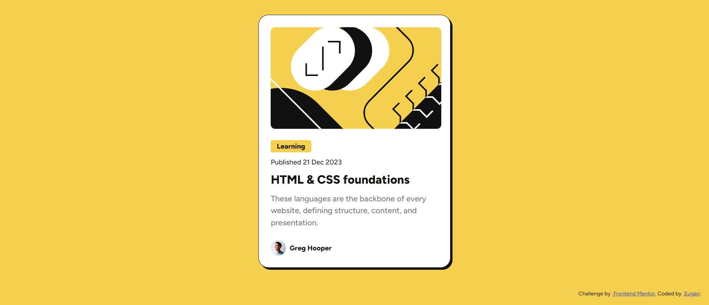

# Frontend Mentor - Blog preview card solution

This is a solution to the [Blog preview card challenge on Frontend Mentor](https://www.frontendmentor.io/challenges/blog-preview-card-ckPaj01IcS). Frontend Mentor challenges help you improve your coding skills by building realistic projects. 

## Table of contents

- [Overview](#overview)
  - [The challenge](#the-challenge)
  - [Screenshot](#screenshot)
  - [Links](#links)
- [My process](#my-process)
  - [Built with](#built-with)
  - [What I learned](#what-i-learned)
  - [Continued development](#continued-development)
  - [Useful resources](#useful-resources)
- [Author](#author)
- [Acknowledgments](#acknowledgments)

## Overview

### The challenge

Users should be able to:

- See hover and focus states for all interactive elements on the page

### Screenshot




### Links

- Solution URL: [Add solution URL here](https://github.com/psdesignro/blog-card-challange)
- Live Site URL: [Add live site URL here](https://psdesignro.github.io/blog-card-challange/)

## My process

### Built with

- Semantic HTML5 markup
- CSS custom properties
- Flexbox


### What I learned

I learnt how to resize font depending on viewport width without using media queries

```css 
:root{
 --fs-heading: clamp(1.25rem, 1vw + 1rem, 1.5rem);
}
```


### Useful resources

Great video for responsive typography[Youtube](https://www.youtube.com/watch?v=wARbgs5Fmuw)

### Continued development

I will continue with the Frontend Mentor in my transition from designer to dev.


## Author

- Website - [Eugen](https://github.com/psdesignro)
- Frontend Mentor - [@psdesignro](https://www.frontendmentor.io/profile/psdesignro)
